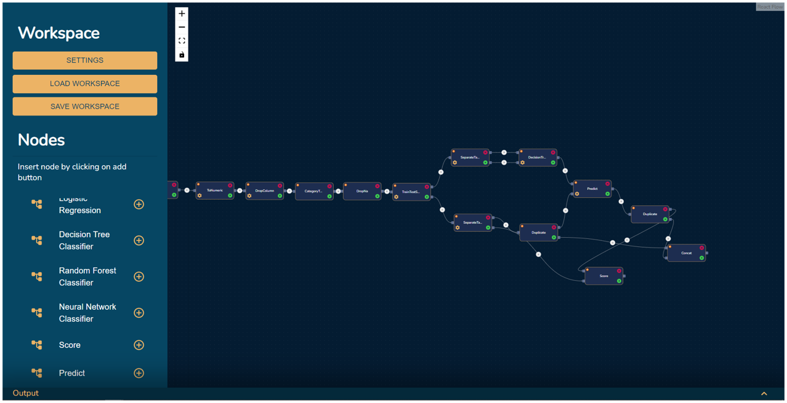
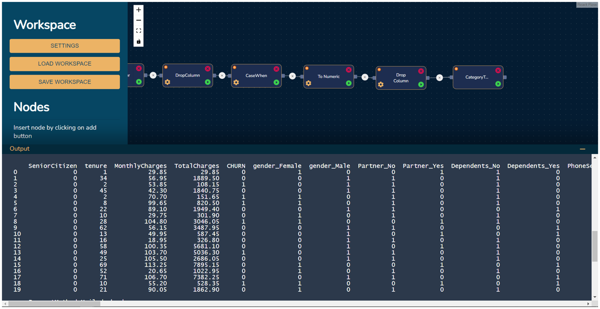

# DM4CRM
## A GUI Data Mining Service for SuiteCRM

This is the output system of my bachelor's thesis project at Amirkabir University. In this project, I developed a GUI analytical system that can extract data from an open source CRM called SuiteCRM and other data sources and is able to perform different transformation on the data and prepare it for data mining processes and even machine learning algorithms. This tool can generate python code which uses Pandas+Scikit-learn or Pyspark and run them with different engines for the analytical process.





## Technology Stack
- [Django](https://www.djangoproject.com/) - [🛠](https://stackshare.io/django) - [🐙](https://github.com/django/django) - The Web framework for perfectionists with deadlines.
- [React](https://reactjs.org/) - [🛠](https://stackshare.io/react) - [🐙](https://github.com/facebook/react) - React components can be used on the client and server side.
- [MongoDB](https://www.mongodb.com/) - [🛠️](https://stackshare.io/mongodb) - [🐙](https://github.com/mongodb/mongo) - A document and JSON-oriented database.
- [Apache Spark](https://spark.apache.org) - [🛠](https://stackshare.io/spark) - [🐙](https://github.com/apache/spark) - Fast and general engine for large-scale data processing.

## Getting Started

These instructions will get you a copy of the project up and running on your local machine for development and testing purposes. See deployment for notes on how to deploy the project on a live system.

### Prerequisites

What things you need to install the software and how to install them

```
- Python3.6+
- Pandas, Scikit-learn, Pyspark modulkes installed globally or in virtual environment
- Django
```

## Demo


## License

This project is licensed under the MIT License
